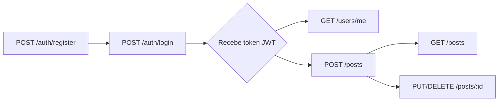

# Guia de uso — Node REST Blueprint

Este guia mostra, passo a passo, como consumir cada endpoint da API. Os exemplos usam `curl`, mas são facilmente adaptáveis para Postman, Insomnia, HTTPie, Bruno ou qualquer client HTTP.

> Para subir o projeto localmente, veja primeiro o [README](README.md#quick-start).

## Sumário

- [Convenções](#convenções)
- [Fluxo recomendado](#fluxo-recomendado)
- [Auth](#auth)
  - [Criar conta — `POST /auth/register`](#criar-conta--post-authregister)
  - [Login — `POST /auth/login`](#login--post-authlogin)
- [Usuário autenticado](#usuário-autenticado)
  - [Ver perfil — `GET /users/me`](#ver-perfil--get-usersme)
  - [Atualizar perfil — `PUT /users/me`](#atualizar-perfil--put-usersme)
  - [Deletar conta — `DELETE /users/me`](#deletar-conta--delete-usersme)
- [Posts](#posts)
  - [Listar posts — `GET /posts`](#listar-posts--get-posts)
  - [Detalhe — `GET /posts/:id`](#detalhe--get-postsid)
  - [Criar — `POST /posts`](#criar--post-posts)
  - [Atualizar — `PUT /posts/:id`](#atualizar--put-postsid)
  - [Deletar — `DELETE /posts/:id`](#deletar--delete-postsid)
- [Códigos de erro](#códigos-de-erro)
- [Dicas](#dicas)

## Convenções

- Base URL nos exemplos: `http://localhost:3000`
- Todas as requisições com body usam `Content-Type: application/json`
- O token JWT é retornado pelo login e enviado em todos os endpoints protegidos no header:

```http
Authorization: Bearer <token>
```

## Fluxo recomendado



1. Criar conta (`/auth/register`)
2. Logar (`/auth/login`) → guardar o `token`
3. Usar o token nas chamadas protegidas (`Authorization: Bearer ...`)

## Auth

### Criar conta — `POST /auth/register`

Cria um novo usuário. Senha é hasheada com bcrypt antes de salvar; nunca é retornada.

```bash
curl -X POST http://localhost:3000/auth/register \
  -H "Content-Type: application/json" \
  -d '{
    "name": "Maria Silva",
    "email": "maria@example.com",
    "password": "senha-forte-123"
  }'
```

**Resposta `201 Created`**

```json
{
  "user": {
    "id": "8f7e8a3a-7e8d-4c4f-9c5e-2b9a8d6e4f1a",
    "name": "Maria Silva",
    "email": "maria@example.com",
    "createdAt": "2026-05-15T10:00:00.000Z",
    "updatedAt": "2026-05-15T10:00:00.000Z"
  }
}
```

**Erros comuns**

- `400 ValidationError` — campos faltando ou inválidos
- `409 ConflictError` — email já cadastrado
- `429 TooManyRequests` — excedeu o rate limit

### Login — `POST /auth/login`

Autentica e retorna um JWT.

```bash
curl -X POST http://localhost:3000/auth/login \
  -H "Content-Type: application/json" \
  -d '{
    "email": "maria@example.com",
    "password": "senha-forte-123"
  }'
```

**Resposta `200 OK`**

```json
{
  "token": "eyJhbGciOiJIUzI1NiIs...",
  "user": {
    "id": "8f7e8a3a-7e8d-4c4f-9c5e-2b9a8d6e4f1a",
    "name": "Maria Silva",
    "email": "maria@example.com",
    "createdAt": "2026-05-15T10:00:00.000Z",
    "updatedAt": "2026-05-15T10:00:00.000Z"
  }
}
```

> Dica: salve o token numa variável shell para reutilizar:
> ```bash
> TOKEN=$(curl -s -X POST http://localhost:3000/auth/login \
>   -H "Content-Type: application/json" \
>   -d '{"email":"maria@example.com","password":"senha-forte-123"}' \
>   | jq -r .token)
> ```

**Erros comuns**

- `401 Unauthorized` — `Credenciais inválidas` (mesma mensagem para email inexistente OU senha errada, por segurança)
- `400 ValidationError` — formato do email inválido
- `429 TooManyRequests` — rate limit excedido

## Usuário autenticado

Todos os endpoints abaixo exigem o header `Authorization: Bearer $TOKEN`.

### Ver perfil — `GET /users/me`

```bash
curl http://localhost:3000/users/me \
  -H "Authorization: Bearer $TOKEN"
```

**Resposta `200 OK`**

```json
{
  "user": {
    "id": "8f7e8a3a-...",
    "name": "Maria Silva",
    "email": "maria@example.com",
    "createdAt": "2026-05-15T10:00:00.000Z",
    "updatedAt": "2026-05-15T10:00:00.000Z"
  }
}
```

### Atualizar perfil — `PUT /users/me`

`name` e `email` são opcionais individualmente, mas pelo menos um deve estar presente.

```bash
curl -X PUT http://localhost:3000/users/me \
  -H "Authorization: Bearer $TOKEN" \
  -H "Content-Type: application/json" \
  -d '{ "name": "Maria S. Silva" }'
```

**Erros comuns**

- `400 ValidationError` — body vazio ou email inválido
- `401 Unauthorized` — token ausente/inválido/expirado
- `409 ConflictError` — email já em uso por outro usuário

### Deletar conta — `DELETE /users/me`

Remove a conta e, em cascade, todos os posts do usuário.

```bash
curl -X DELETE http://localhost:3000/users/me \
  -H "Authorization: Bearer $TOKEN"
```

**Resposta `204 No Content`** (sem body)

## Posts

### Listar posts — `GET /posts`

Endpoint **público**. Retorna apenas posts com `published: true`, ordenados por mais recentes.

**Query params**

| Param    | Tipo    | Default | Descrição                                     |
| -------- | ------- | ------- | --------------------------------------------- |
| `page`   | integer | `1`     | Página (1-indexed)                            |
| `limit`  | integer | `10`    | Itens por página (máx. 100)                   |
| `search` | string  | —       | Filtra por `title` (case-insensitive, contém) |

```bash
curl "http://localhost:3000/posts?page=1&limit=10&search=node"
```

**Resposta `200 OK`**

```json
{
  "data": [
    {
      "id": "1c2b3d4e-...",
      "title": "Primeiro post sobre Node",
      "content": "Conteúdo...",
      "published": true,
      "authorId": "8f7e8a3a-...",
      "author": { "id": "8f7e8a3a-...", "name": "Maria Silva" },
      "createdAt": "2026-05-15T11:00:00.000Z",
      "updatedAt": "2026-05-15T11:00:00.000Z"
    }
  ],
  "pagination": {
    "page": 1,
    "limit": 10,
    "total": 1,
    "totalPages": 1
  }
}
```

### Detalhe — `GET /posts/:id`

Endpoint **público**. Posts com `published: false` retornam `404` (não vazam existência).

```bash
curl http://localhost:3000/posts/1c2b3d4e-...
```

### Criar — `POST /posts`

Requer autenticação. O autor é sempre o usuário logado.

```bash
curl -X POST http://localhost:3000/posts \
  -H "Authorization: Bearer $TOKEN" \
  -H "Content-Type: application/json" \
  -d '{
    "title": "Como estruturar uma REST API com Express",
    "content": "Texto completo do post...",
    "published": true
  }'
```

**Resposta `201 Created`**

```json
{
  "post": {
    "id": "1c2b3d4e-...",
    "title": "Como estruturar uma REST API com Express",
    "content": "Texto completo do post...",
    "published": true,
    "authorId": "8f7e8a3a-...",
    "author": { "id": "8f7e8a3a-...", "name": "Maria Silva" },
    "createdAt": "2026-05-15T11:30:00.000Z",
    "updatedAt": "2026-05-15T11:30:00.000Z"
  }
}
```

**Validações**

- `title`: obrigatório, 3–180 caracteres
- `content`: opcional, até 50.000 caracteres
- `published`: opcional, default `false`

### Atualizar — `PUT /posts/:id`

Requer autenticação. **Só o autor** do post pode atualizar (caso contrário retorna `403`).

```bash
curl -X PUT http://localhost:3000/posts/1c2b3d4e-... \
  -H "Authorization: Bearer $TOKEN" \
  -H "Content-Type: application/json" \
  -d '{ "published": false }'
```

**Erros comuns**

- `400 ValidationError` — body vazio ou campos inválidos
- `401 Unauthorized` — token ausente/inválido
- `403 ForbiddenError` — você não é o autor
- `404 NotFoundError` — post não existe

### Deletar — `DELETE /posts/:id`

Requer autenticação. Só o autor pode deletar.

```bash
curl -X DELETE http://localhost:3000/posts/1c2b3d4e-... \
  -H "Authorization: Bearer $TOKEN"
```

**Resposta `204 No Content`**

## Códigos de erro

A API retorna sempre um objeto com a forma:

```json
{
  "error": "NomeDoErro",
  "message": "Descrição humana",
  "details": [ /* opcional, presente em ValidationError */ ]
}
```

| Status | Erro                  | Quando acontece                                                          |
| ------ | --------------------- | ------------------------------------------------------------------------ |
| `400`  | `ValidationError`     | Body/query/params inválidos (`details` lista as issues)                  |
| `401`  | `UnauthorizedError`   | Token ausente, inválido, expirado, ou credenciais inválidas              |
| `403`  | `ForbiddenError`      | Autenticado mas sem permissão (ex: editar post de outro usuário)         |
| `404`  | `NotFoundError`       | Rota ou recurso não existe (ou post não publicado em rotas públicas)     |
| `409`  | `ConflictError`       | Email duplicado em register/update                                       |
| `429`  | `TooManyRequests`     | Rate limit excedido em `/auth/*`                                         |
| `500`  | `InternalServerError` | Erro inesperado (sem stack trace em produção)                            |

## Dicas

- Em desenvolvimento, prefira a **Swagger UI** em `http://localhost:3000/api-docs` — você cola o token uma vez no botão **Authorize** e pode testar todos os endpoints pelo navegador.
- Para gerar um `JWT_SECRET` forte: `node -e "console.log(require('crypto').randomBytes(48).toString('hex'))"`
- Em produção, **configure `CORS_ORIGIN`** com a lista exata de origens permitidas (não use `*`).
- Aumente `BCRYPT_SALT_ROUNDS` em produção (12+) e mantenha baixo (4) em testes para acelerar.
- O rate limit aplica-se por IP — se sua app está atrás de proxy/load balancer, `trust proxy` já está configurado no Express.
